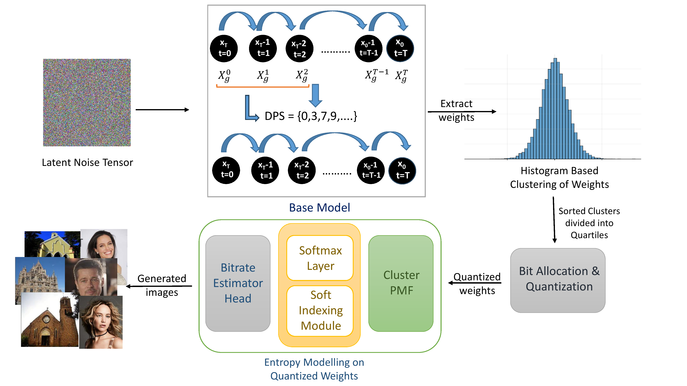

# 🚀 E-Quant: Entropy Enabled Soft Quantization in Diffusion Models
---
## 📖 INTRODUCTION
---
#### This repository contains official implementation of E-Quant.
#### E-quant introduces a novel training free pipeline which combines adaptive cluster based quantization with entropy modelling.

---
## 🗝️ Environment <br>
#### Create and activate a suitable conda environment named equant by using the following commands:
```bash
cd E-Quant
conda env create -f environment.yaml
conda activate equant
```
---
## 💠 Download Checkpoints
```bash
bash mainldm/scripts/download_models.sh
```
---
## 📕 Data <br>
#### Please download all original datasets used for evaluation from each dataset’s official website.
---
## 🔧 Example Usage
```bash
python ./mainldm/celeb_cali.py
```
```bash
python ./mainldm/celeb_predadd.py
```
```bash
python ./error_dec/celeb/celeb_dec.py --error cache
```
```bash
python ./mainldm/celeb_params.py
```
```bash
python ./error_dec/celeb/celeb_dec.py --error quant
```
```bash
python ./mainldm/celeb_cluster.py
```
```bash
python ./mainldm/celeb_clustering_per_layer.py
```
```bash
python ./mainldm/celeb_split_clusters.py
```
```bash
python ./mainldm/celeb_quant.py
```
